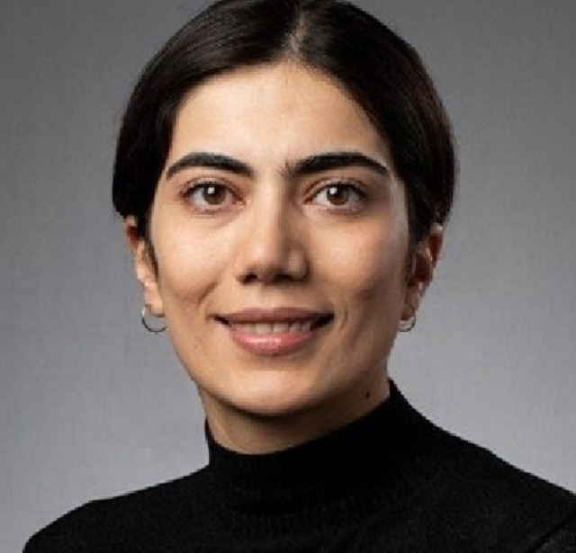

::: {.hero}
::: {.hero-photo}
{alt="Portrait of Tahereh Gholipourshahraki"}
:::

::: {.hero-text}
# Tahereh Gholipourshahraki

**Postdoctoral Researcher, PharmD, Ph.D.**\
National Centre for Register-based Research, Aarhus University\
Aarhus, Denmark

I am an interdisciplinary researcher with training in clinical pharmacy and current
expertise in statistical genetics and applied bioinformatics. My work focuses on
computational and statistical methods for complex human disease — particularly
polygenic modelling, fine-mapping, and gene–environment analysis of large-scale
genomic and register-based data.

<a class="link-pill" href="mailto:tgh.ncrr@au.dk">✉ Email</a>
<a class="link-pill" href="https://orcid.org/0000-0003-0228-4177">ORCID</a>
<a class="link-pill" href="https://www.linkedin.com/in/tahereh-gholipour-261675b9/">LinkedIn</a>
<a class="link-pill" href="https://pure.au.dk/portal/en/persons/tgh.ncrr@au.dk">AU Profile</a>
<a class="link-pill" href="publications.qmd">Publications</a>

:::
:::

## Research interests

Statistical genetics
Computational genomics
Polygenic modelling &amp; fine-mapping
Gene–environment interaction
Psychiatric genetics
Register-based &amp; longitudinal data
Reproducible workflows in R

## Currently

- Postdoctoral researcher at the [National Centre for Register-based Research](https://ncrr.au.dk/) (NCRR), Aarhus University, since June 2024
- Course developer, leader, and instructor for **Basic R** and **Advanced R** (PhD-level courses, Aarhus University)
- Co-supervising three PhD research projects in statistical genetics and epidemiology
- European Society of Human Genetics (ESHG) Fellowship for European Countries, 2025

## Selected recent work

**Estimating Within- and Between-Family Polygenic Effects For Psychiatric Disorders Under Non-random Ascertainment**\
Gholipourshahraki T\*, et al. *medRxiv*, 2026. [Read preprint →](https://www.medrxiv.org/content/10.64898/2026.07.28.26359090v1.full)

**Polygenic Scores and Environmental Factors in Psychiatric Disorders: Gene–Environment Interaction Analyses Using the iPSYCH Study**\
Gholipourshahraki T\*, et al. *medRxiv*, 2025. [Read preprint →](https://www.medrxiv.org/content/10.1101/2025.10.07.25337407v1)

**Evaluation of Bayesian Linear Regression models for gene set prioritization in complex diseases**\
Gholipourshahraki T\*, et al. *PLOS Genetics*, 2024. [Read article →](https://doi.org/10.1371/journal.pgen.1011463)

[See the full publication list →](publications.qmd)
